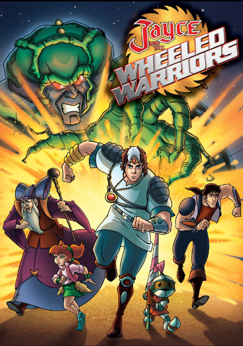

# Jayce n the Wheeled Warriors Parser

 A naive attempt at writing my own json parser - for fun not profit or fame!

 

## TODO

1. Tidy up! Especially JaycenParser
2. Create raw json strings from Jaycen and enable pretty printing
3. Return some kind of ADT when things go wrong rather than throw exceptions
4. Make extracting values from jaycen stricter than just get
5. More tests!
6. Make it RFC 7159 compliant? Here are some tests https://github.com/nst/JSONTestSuite

note: JayArray can contain other types than String
